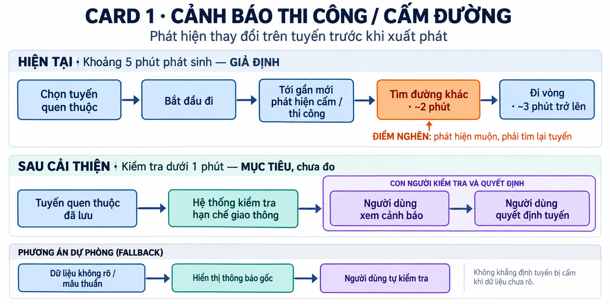
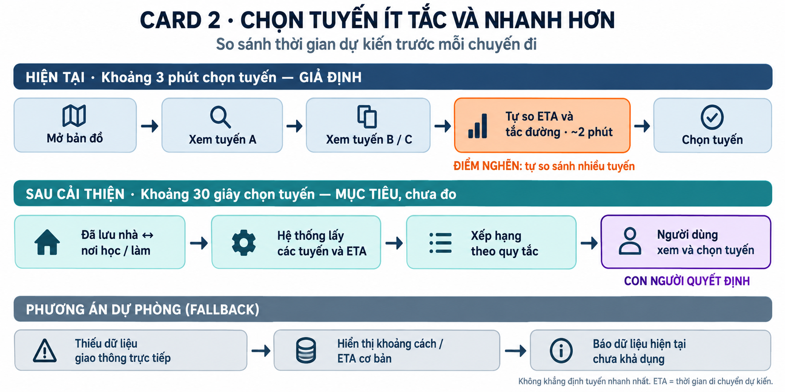
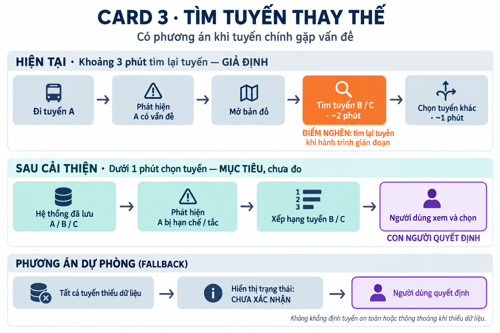

# 01 — Individual Problem Scan

## Thông tin cá nhân

- Họ và tên: Ngô Minh Thu
- Mã học viên: 2A202602679
- Vai trò / bối cảnh (VD: sinh viên năm X, intern PM, ...): **Người tham gia giao thông thường xuyên di chuyển giữa nhà và nơi học tập/làm việc.**
- Công việc hằng tuần (3-5 gạch đầu dòng để soi problem):
  - Di chuyển từ nhà đến nơi học tập/làm việc và ngược lại.
  - Lựa chọn tuyến đường phù hợp trước khi xuất phát.
  - Kiểm tra tình trạng ùn tắc trên tuyến thường đi.
  - Theo dõi các đoạn đường đang thi công, cấm đường hoặc thay đổi tổ chức giao thông.
  - Tìm tuyến thay thế khi tuyến quen thuộc xảy ra ùn tắc hoặc sự cố.

---

## Phase 1 — Scan 5+ problems (tối thiểu 5, khuyến khích 8-10)

| #   | Lăng kính (Lặp lại / Tốn thời gian / AI có thể tốt hơn / Pain từ người khác) | Problem quan sát được                                                                                                                                                                   | Ai chịu ảnh hưởng?                                                            | Dấu hiệu thật (số + bằng chứng)                                                                                                                                                                                                                                      |
| --- | ---------------------------------------------------------------------------- | --------------------------------------------------------------------------------------------------------------------------------------------------------------------------------------- | ----------------------------------------------------------------------------- | -------------------------------------------------------------------------------------------------------------------------------------------------------------------------------------------------------------------------------------------------------------------- |
| 1   | Lặp lại                                                                      | Người thường xuyên đi từ nhà đến nơi học/làm thường chỉ quen 1-2 tuyến và không biết còn những tuyến thay thế nào nếu tuyến chính xảy ra ùn tắc hoặc sự cố.                             | Người đi làm, sinh viên, người thường xuyên di chuyển trên cùng hành trình.   | Hà Nội ghi nhận **37 điểm/trục tuyến ùn tắc trong năm 2025**, cho thấy tuyến quen thuộc có thể bị ảnh hưởng và người đi đường cần có phương án thay thế. Chưa có số cá nhân nên cần ghi lại ít nhất **5-10 chuyến** để biết mình thường cân nhắc bao nhiêu tuyến.    |
| 2   | Tốn thời gian                                                                | Người tham gia giao thông khó biết tuyến ngắn nhất về khoảng cách có phải tuyến nhanh nhất tại đúng thời điểm xuất phát hay không.                                                      | Người đi học, đi làm và người có giờ đến nơi cố định.                         | Kế hoạch giao thông Hà Nội năm 2025 đặt mục tiêu xử lý **8-10 điểm ùn tắc** và hạn chế ùn tắc kéo dài **trên 30 phút**. Cần bấm giờ **5-10 chuyến cá nhân** để so sánh ETA với thời gian thực tế.                                                                    |
| 3   | Pain từ người khác                                                           | Người đi đường có thể không biết trước đoạn đường quen thuộc đang thi công, bị cấm hoặc thay đổi tổ chức giao thông và chỉ phát hiện khi đã đi gần tới đó.                              | Người tham gia giao thông sử dụng tuyến đường thường xuyên.                   | Trong **6 tháng đầu năm 2025**, Hà Nội đã điều chỉnh tổ chức giao thông tại **142 vị trí** và ban hành **38 thông báo** điều chỉnh trên các tuyến, nút giao.                                                                                                         |
| 4   | AI có thể tốt hơn                                                            | Thông tin về cấm đường, phân luồng hoặc thi công được viết thành nhiều thông báo khác nhau; người dùng phải tự đọc để xác định thông báo nào liên quan trực tiếp tới tuyến mình sắp đi. | Người đi làm, sinh viên, tài xế và người thường xuyên di chuyển.              | Chỉ trong **6 tháng đầu năm 2025 đã có 38 thông báo điều chỉnh tổ chức giao thông** tại Hà Nội. Đây là dấu hiệu cho thấy người dùng có nhiều thông tin thay đổi phải theo dõi.                                                                                       |
| 5   | Lặp lại + Tốn thời gian                                                      | Người đi đường phải kiểm tra lại tình hình giao thông trước mỗi chuyến đi dù ngày nào cũng di chuyển giữa hai địa điểm gần như cố định.                                                 | Người đi học/đi làm hằng ngày.                                                | Nếu đi học/làm **5 ngày/tuần**, một người có ít nhất khoảng **10 lượt đi-về/tuần** trên hành trình cố định. Cần bấm giờ thực tế để biết mỗi lần kiểm tra tuyến mất bao lâu.                                                                                          |
| 6   | Tốn thời gian                                                                | Khi tuyến đang đi phát sinh ùn tắc, người điều khiển phương tiện phải tự quyết định nên tiếp tục chờ hay chuyển sang đường khác.                                                        | Người đang tham gia giao thông và người có lịch hẹn/giờ làm cố định.          | Hà Nội có **37 điểm/trục ùn tắc trong năm 2025**; trong 6 tháng đầu năm mới xử lý được **2/37 điểm** được ghi nhận tại thời điểm báo cáo. Cần ghi nhật ký chuyến đi để đo số lần cá nhân phải đổi tuyến.                                                             |
| 7   | Pain từ người khác                                                           | Việc thay đổi tổ chức giao thông theo từng đoạn hoặc từng hướng khiến người không thường xuyên đi qua khu vực đó dễ chọn nhầm hướng hoặc phải quay lại.                                 | Người đi đường không quen khu vực, người giao hàng, tài xế và khách vãng lai. | Đầu năm 2025, Hà Nội từng điều chỉnh giao thông tại **68 vị trí và ban hành 41 thông báo** theo báo cáo quý I; các thay đổi diễn ra ở nhiều vị trí khác nhau.                                                                                                        |
| 8   | Tốn thời gian + AI có thể tốt hơn                                            | Người đi đường khó biết nên xuất phát sớm hơn bao nhiêu phút để đến đúng giờ khi tình trạng giao thông thay đổi từng ngày.                                                              | Người đi học, đi làm hoặc có lịch hẹn cố định.                                | Hà Nội có khoảng **9,2 triệu phương tiện** lưu thông, trong khi tốc độ tăng phương tiện cá nhân khoảng **4-5%/năm**, cao hơn tốc độ phát triển hạ tầng khoảng **0,35%/năm**. Chưa có baseline cá nhân; cần ghi ETA và thời gian thực tế của ít nhất **5-10 chuyến**. |

> Ghi chú bằng chứng: Bảng hiện có 8 problems. Các số liệu giao thông năm 2025 trong bản nháp chưa kèm nguồn để đối chiếu; chúng là thông tin bối cảnh, chưa phải số đo trải nghiệm cá nhân. Các mốc 5-10 chuyến là kế hoạch đo, không phải kết quả đã thu thập. Cần bổ sung nguồn và nhật ký thực tế trước khi đánh dấu hoàn thành tiêu chí số đo.

> Gợi ý tự soi: tuần trước mất nhiều thời gian nhất vào việc gì? Việc gì hay trì hoãn? Người khác hay hỏi lại câu gì? Workflow nào ai cũng biết là chậm?

**AI đã dùng ở Phase 1 (nếu có):**

- Prompt đã hỏi:

```text
Tôi là người tham gia giao thông thường xuyên di chuyển từ nhà đến
nơi học tập/làm việc và ngược lại.

Tôi đã nghĩ ra các vấn đề:
1. Có bao nhiêu đường có thể đi từ nơi làm việc/học tập về nhà và ngược lại?
2. Cách đi nào ít tắc đường và có thời gian di chuyển ngắn nhất?
3. Trong hành trình có đoạn đường nào đang thi công, bị cấm hoặc
   thay đổi tổ chức giao thông hay không?

Hãy gợi ý thêm problem theo 4 lăng kính:
- Lặp lại
- Tốn thời gian
- AI có thể tốt hơn
- Pain từ người khác

Với mỗi gợi ý, ghi actor, workflow sơ bộ và cách đo.
Không đưa ý tưởng quá rộng kiểu "xây trợ lý AI giao thông toàn năng".
Nếu Rule, Workflow hoặc process fix đơn giản giải quyết được thì
ưu tiên chúng trước AI hoặc Agent.
```

- Ý dùng được:
  - Tìm các tuyến thay thế giữa hai địa điểm thường xuyên di chuyển.
  - So sánh tuyến để chọn đường ít tắc và có thời gian dự kiến ngắn hơn.
  - Phát hiện trước đoạn đường đang thi công, cấm hoặc phân luồng.
  - Tổng hợp các thông báo giao thông liên quan đến tuyến thường đi.
  - Hỗ trợ xác định thời điểm nên xuất phát để đến đúng giờ.

- Ý bỏ vì không phải pain thật:
  - “Xây AI quản lý toàn bộ giao thông thành phố” vì phạm vi quá rộng.
  - “AI tự lái xe và tự lựa chọn mọi hành động” vì không đúng phạm vi problem.
  - Dùng LLM để tính shortest path trong khi thuật toán routing thông thường phù hợp hơn.
  - Dùng Agent cho một bài toán chỉ cần database + rule + notification.
  - Những con số như “mất 10 phút mỗi ngày” khi chưa tự bấm giờ thực tế.

**Self-check Phase 1:**

- [ ] Đủ 5+ dòng, mỗi dòng có actor + số đo cụ thể
- [x] Dùng ít nhất 3/4 lăng kính
- [x] Không có dòng chung chung kiểu "mất nhiều thời gian"

---

## Phase 2 — Top 3 Problem Cards

### 2.1. Chọn top 3

Giữ bài nào: actor cụ thể, workflow vẽ được 3-7 bước, bottleneck ở 1 bước, impact đo được. Loại bài quá rộng.

| Rank | Problem (copy từ bảng scan)                                                                                                     | Vì sao chọn (2-3 ý)                                                                                                                                                                                      | Điều còn chưa chắc                                                                                                                  |
| ---- | ------------------------------------------------------------------------------------------------------------------------------- | -------------------------------------------------------------------------------------------------------------------------------------------------------------------------------------------------------- | ----------------------------------------------------------------------------------------------------------------------------------- |
| 1    | **Người đi đường có thể không biết trước đoạn đường quen thuộc đang thi công, bị cấm hoặc thay đổi tổ chức giao thông.**        | Actor rõ; workflow có thể vẽ từ trước lúc xuất phát đến khi phát hiện restriction; có số liệu thật về 142 vị trí điều chỉnh và 38 thông báo trong 6 tháng. Có thể thử giải bằng dữ liệu + rule trước AI. | Chưa biết cá nhân thực tế gặp tình huống này bao nhiêu lần/tháng và mỗi lần mất thêm bao nhiêu phút.                                |
| 2    | **Người tham gia giao thông khó biết tuyến ngắn nhất có phải tuyến nhanh nhất tại thời điểm xuất phát hay không.**              | Xảy ra lặp lại khi đi học/làm; bottleneck nằm ở bước so sánh nhiều route; impact đo được bằng thời gian chọn route và actual travel time. Có thể dùng routing/rule mà chưa cần AI.                       | Các ứng dụng bản đồ hiện tại đã giải quyết được bao nhiêu phần trăm problem và pain nào vẫn còn tồn tại.                            |
| 3    | **Người thường xuyên đi giữa hai địa điểm chỉ quen một số tuyến và khó biết tuyến thay thế phù hợp khi tuyến chính gặp sự cố.** | Workflow đơn giản và dễ prototype; có thể đo số route tìm được, thời gian tìm route thay thế và số lần phải quay đầu. Không cần LLM để tìm đường.                                                        | Chưa biết người dùng thực tế cần route thay thế bao nhiêu lần và các route thay thế có phù hợp với từng loại phương tiện hay không. |

### 2.2. Problem Cards chi tiết (lặp lại cho cả 3 cards)

---

#### Problem Card #1 — Cảnh báo đoạn đường thi công / cấm / phân luồng

```text
Problem 1 câu:

Người tham gia giao thông thường xuyên đi trên một tuyến quen thuộc
có thể không biết trước đoạn đường đó đang thi công, bị cấm hoặc
thay đổi tổ chức giao thông, dẫn đến phải đổi đường khi đã tới gần khu vực.

Actor:

Người tham gia giao thông thường xuyên di chuyển từ nhà đến
nơi học tập/làm việc.

Thời điểm / bối cảnh:

Trước khi xuất phát hoặc ngay trước khi đi vào đoạn đường
có thay đổi tổ chức giao thông.

Current workflow 3-7 bước:
1. Người dùng chuẩn bị xuất phát.
2. Chọn tuyến đường quen thuộc.
3. Có thể mở bản đồ hoặc tìm thông tin giao thông.
4. Bắt đầu đi theo tuyến đã chọn.
5. Khi đến gần mới phát hiện thi công/cấm/phân luồng.
6. Tìm tuyến khác và đi vòng.

Bottleneck:

Người dùng không biết thông báo giao thông nào liên quan trực tiếp
đến tuyến, hướng đi, loại phương tiện và thời điểm mình chuẩn bị đi.

Impact:

Trong 6 tháng đầu năm 2025, Hà Nội có 142 vị trí được điều chỉnh
tổ chức giao thông và 38 thông báo điều chỉnh.

Impact cá nhân cần đo thêm:
- số lần/tháng gặp restriction ngoài dự kiến;
- số phút phải đi vòng;
- số km phát sinh.

Ví dụ scoping:
Nếu một lần đi vòng phát sinh 10 phút và xảy ra 2 lần/tháng
thì impact giả định = 20 phút/tháng.

Con số trên chỉ là giả định, chưa phải fact.

Success metric:

- Tỷ lệ restriction liên quan được phát hiện trước khi xuất phát.
- Giảm số lần phải quay đầu hoặc đổi tuyến bất ngờ.
- Giảm số phút/km phát sinh.
- False alert rate thấp.
- Mỗi cảnh báo có nguồn và thời gian hiệu lực rõ ràng.

Non-AI alternative:

Database + rule + notification.

Lưu các thông báo dưới dạng:
road, from, to, direction, vehicle_type,
start_time, end_time, restriction.

So khớp dữ liệu đó với tuyến thường đi của người dùng.
Nếu có giao nhau và còn hiệu lực thì cảnh báo trước khi xuất phát.

AI hypothesis:

AI không bắt buộc cho MVP.

LLM có thể hỗ trợ đọc thông báo dạng văn bản và trích xuất thành
structured data nhưng không được tự suy đoán thông tin không có trong nguồn.

Nếu parser/rule truyền thống đủ tốt thì ưu tiên parser/rule.

Quick gut:
[ ] No AI / process fix
[ ] Rule
[X] Workflow
[ ] Agent
[ ] Chưa biết
```

**Draft workflow Card #1** (ASCII / Mermaid / ảnh đính kèm):

```text
CURRENT STATE — ~5 phút phát sinh (GIẢ ĐỊNH, cần đo thật)

[1 Chọn tuyến quen thuộc: <1']
→ [2 Bắt đầu đi]
→ [3 Phát hiện cấm/thi công khi tới gần]
→ [4 Tìm đường khác: ~2']  <-- bottleneck
→ [5 Đi vòng: ~3'+]

FUTURE STATE — <1 phút kiểm tra trước chuyến đi (MỤC TIÊU, chưa đo)

[1 Tuyến quen thuộc đã lưu]
→ [2 System check restriction]
→ [3 User review cảnh báo: <1']  <-- human boundary
→ [4 User quyết định tuyến]

Fallback: nếu dữ liệu không rõ hoặc mâu thuẫn
→ không khẳng định tuyến bị cấm
→ hiển thị thông báo gốc
→ người dùng tự kiểm tra và quyết định.
```



---

#### Problem Card #2 — Chọn tuyến ít tắc và nhanh hơn

```text
Problem 1 câu:

Người tham gia giao thông có nhiều tuyến có thể đi giữa nhà
và nơi học/làm nhưng khó biết tuyến nào có thời gian di chuyển
ngắn nhất tại đúng thời điểm xuất phát.

Actor:

Người đi học hoặc đi làm thường xuyên di chuyển giữa hai địa điểm cố định.

Thời điểm / bối cảnh:

Trước mỗi chuyến đi từ nhà đến nơi học/làm và chiều ngược lại.

Current workflow 3-7 bước:
1. Người dùng chuẩn bị xuất phát.
2. Mở bản đồ.
3. Xem tuyến A.
4. Xem tuyến B/C.
5. So sánh khoảng cách, ETA và tình trạng ùn tắc.
6. Chọn một tuyến.
7. Xuất phát.

Bottleneck:

Bước so sánh nhiều tuyến:
tuyến ngắn nhất về km không phải lúc nào cũng có ETA thấp nhất
do tình trạng ùn tắc thay đổi theo thời gian.

Impact:

Hà Nội có 37 điểm/trục ùn tắc trong năm 2025.

Baseline cá nhân chưa có.

Cần bấm giờ 5-10 chuyến:
- thời gian từ lúc mở app đến khi chọn route;
- ETA;
- actual travel time;
- số lần đổi route.

Ví dụ scoping:
Nếu current state mất 3 phút để kiểm tra route
và future state còn 30 giây,
tiết kiệm giả định 2,5 phút/chuyến.

Success metric:

- Giảm thời gian lựa chọn route.
- Giảm actual travel time trung bình.
- Giảm chênh lệch giữa ETA và thời gian thực tế.
- Giảm số lần đổi tuyến ngoài dự kiến.
- Tăng tỷ lệ đến đúng giờ.

Non-AI alternative:

Routing algorithm + rule ranking.

1. Lấy 2-3 route khả dụng.
2. Lấy ETA cho từng route.
3. Kiểm tra congestion/restriction.
4. Rank theo:

score =
ETA
+ congestion_penalty
+ restriction_penalty

5. Hiển thị route có score tốt nhất.

AI hypothesis:

Không cần LLM để giải bài toán cơ bản.

Sau khi có baseline rule, ML chỉ đáng thử nếu có dữ liệu lịch sử
đủ lớn để dự đoán tình trạng tuyến theo giờ/ngày tốt hơn ETA hiện tại.

AI chỉ được giữ nếu chứng minh tốt hơn baseline rule.

Quick gut:
[ ] No AI / process fix
[X] Rule
[ ] Workflow
[ ] Agent
[ ] Chưa biết
```

**Draft workflow Card #2:**

```text
CURRENT STATE — ~3 phút (GIẢ ĐỊNH SCOPING)

[1 Mở bản đồ: <1']
→ [2 Xem route A]
→ [3 Xem route B/C]
→ [4 Tự so ETA + tắc đường: ~2']  <-- bottleneck
→ [5 Chọn route]

FUTURE STATE — ~30 giây (target prototype)

[1 Nhà ↔ nơi học/làm đã lưu]
→ [2 System lấy các route + ETA]
→ [3 Rule rank]
→ [4 User review top route: ~30s]  <-- human boundary

Fallback: nếu không có traffic data real-time
→ hiển thị các route theo khoảng cách/ETA cơ bản
→ ghi rõ dữ liệu giao thông hiện tại chưa khả dụng
→ không khẳng định route là nhanh nhất.
```



---

#### Problem Card #3 — Tìm tuyến thay thế khi tuyến chính gặp vấn đề

```text
Problem 1 câu:

Người thường xuyên đi giữa nhà và nơi học/làm thường chỉ quen
một vài tuyến và phải mất thời gian tìm đường khác khi tuyến chính
xảy ra ùn tắc, thi công hoặc bị hạn chế.

Actor:

Người tham gia giao thông thường xuyên đi trên một hành trình cố định.

Thời điểm / bối cảnh:

Khi chuẩn bị xuất phát hoặc khi phát hiện tuyến chính
đang có ùn tắc/restriction.

Current workflow 3-7 bước:
1. Người dùng thường đi tuyến quen thuộc A.
2. Phát hiện A đang ùn tắc hoặc không thể đi.
3. Mở bản đồ.
4. Tìm tuyến B/C.
5. Kiểm tra tuyến có phù hợp không.
6. Chọn tuyến mới.
7. Tiếp tục hành trình.

Bottleneck:

Bước 3-5:
người dùng phải tìm lại các lựa chọn thay thế trong lúc hành trình
đã bị gián đoạn và không chắc tuyến mới có gặp vấn đề tương tự hay không.

Impact:

Hà Nội có 37 điểm/trục ùn tắc trong năm 2025
và 142 vị trí được điều chỉnh tổ chức giao thông trong
6 tháng đầu năm.

Cần tự đo:
- số lần/tháng phải tìm route khác;
- thời gian tìm route;
- quãng đường phát sinh;
- số lần route thay thế vẫn bị tắc/restriction.

Success metric:

- Thời gian tìm route thay thế.
- Tỷ lệ tìm được ít nhất 1 route khả dụng.
- Giảm số lần phải quay đầu lần thứ hai.
- Giảm quãng đường/thời gian phát sinh.
- Route không đi qua restriction đã biết.

Non-AI alternative:

Pre-compute 2-3 route thay thế cho hành trình cố định.

Ví dụ:
- Route A = route mặc định.
- Route B = phương án thay thế 1.
- Route C = phương án thay thế 2.

Trước chuyến đi:
check trạng thái A/B/C
→ loại route có restriction
→ rank các route còn lại.

Không cần LLM hoặc Agent.

AI hypothesis:

AI có thể được thử sau nếu muốn dự đoán route nào có nguy cơ ùn tắc
dựa trên dữ liệu lịch sử.

Tuy nhiên bài toán cốt lõi vẫn là routing + dữ liệu real-time.
AI không giải quyết được nếu dữ liệu đầu vào thiếu hoặc cũ.

Quick gut:
[ ] No AI / process fix
[X] Rule
[ ] Workflow
[ ] Agent
[ ] Chưa biết
```

**Draft workflow Card #3:**

```text
CURRENT STATE — ~3 phút tìm lại tuyến (GIẢ ĐỊNH)

[1 Đi tuyến A]
→ [2 Phát hiện A có vấn đề]
→ [3 Mở bản đồ]
→ [4 Tìm B/C: ~2']  <-- bottleneck
→ [5 Chọn tuyến khác: ~1']

FUTURE STATE — <1 phút (MỤC TIÊU, chưa đo)

[1 System đã lưu A/B/C]
→ [2 Phát hiện A có restriction/tắc]
→ [3 Rank B/C]
→ [4 User review + chọn: <1']  <-- human boundary

Fallback: nếu tất cả route đều thiếu dữ liệu
→ hiển thị các lựa chọn cùng trạng thái "chưa xác nhận"
→ không tự khẳng định route nào an toàn hoặc thông thoáng
→ người dùng quyết định.
```



---

### 2.3. Card muốn pitch nhất (chuẩn bị 2 phút)

**Card tôi muốn pitch nhất:**

```text
Problem Card #1 — Cảnh báo đoạn đường thi công / cấm / phân luồng:

Giúp người thường xuyên di chuyển trên một tuyến cố định biết trước
đoạn đường sắp đi có đang thi công, bị cấm hoặc thay đổi tổ chức
giao thông hay không, để họ có thể quyết định đổi tuyến trước khi xuất phát.
```

**Vì sao (2-3 câu: workflow gì, số đo gì, impact gì):**

```text
Problem có workflow rõ: người dùng chọn tuyến quen → xuất phát →
phát hiện restriction → phải tìm đường khác. Bottleneck nằm ở việc
restriction được phát hiện quá muộn.

Trong 6 tháng đầu năm 2025, Hà Nội đã điều chỉnh tổ chức giao thông
tại 142 vị trí và ban hành 38 thông báo, cho thấy việc thay đổi tổ chức
giao thông xảy ra thực tế và có thể đo được.

Impact có thể đo bằng số restriction phát hiện trước chuyến đi,
số lần phải quay đầu, số phút đi vòng và quãng đường phát sinh.
MVP có thể dùng data + rule + notification, chưa cần AI.
```

**Câu hỏi tôi muốn nhóm challenge (1-2 câu hỏi đúng chỗ yếu):**

```text
1. Problem này có còn đủ pain nếu Google Maps hoặc các ứng dụng
navigation hiện tại đã cảnh báo được phần lớn cấm đường và thi công?

2. Bottleneck thật sự là khả năng xử lý thông tin hay là việc
có được nguồn dữ liệu restriction đủ nhanh và chính xác?
```

**AI phản biện Card (nếu có):**

- Điểm yếu AI chỉ ra:
  - Chưa có baseline cá nhân về số lần thực sự gặp cấm đường hoặc thi công ngoài dự kiến.
  - Một phần problem đã được ứng dụng bản đồ hiện tại giải quyết.
  - Bottleneck lớn nhất có thể là độ mới và độ chính xác của dữ liệu, không phải AI.
  - Nếu thông báo có cấu trúc tương đối ổn định thì parser/rule có thể rẻ và kiểm soát tốt hơn LLM.
- Tôi sửa gì:
  - Thu hẹp actor thành người thường xuyên di chuyển trên một số tuyến cố định.
  - Chỉ cảnh báo những restriction giao với route đã lưu.
  - Ưu tiên dữ liệu từ nguồn chính thức.
  - MVP dùng database + rule + notification.
  - Chỉ thử LLM ở bước extract thông báo văn bản nếu parser thông thường chưa đủ.
  - AI không được tự tạo hoặc suy đoán restriction.
  - Cần tự theo dõi ít nhất 5-10 chuyến để lấy baseline thật.

