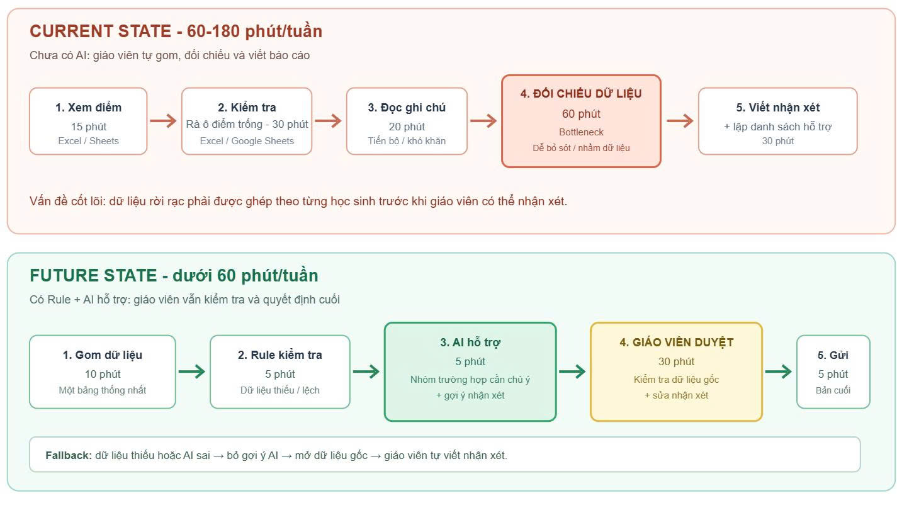

# 02 — Group Problem Statement (Bản nộp nhóm)

> Làm chung 1 bản, mỗi thành viên copy vào repo cá nhân. Đi theo Phase 3 → 6 trong `01-worksheet.md`. Nhóm chỉ chọn **candidate problem** ở Phase 3, viết Problem Statement sau khi validate + vẽ workflow.

## Thành viên nhóm

| STT | Họ và tên | Mã học viên | Vai trò trong nhóm (VD: facilitator, workflow, research, writer) |
|-----|-----------|-------------|---------------------------------------------------------------|
| 1   | Trần Thanh Thái | 2A202602454 | Facilitator |
| 2   | Cao Đức Hiếu    | 2A202602701 | Research |
| 3   | Dương Hữu Đạt   | 2A202602544 | Product Owner |
| 4   | Trần Công Thiện | 2A202602579 | AI/Workflow |
| 5   | Lê Quang Ngọc   | 2A202602664 | Writer |
| 6   | Ngô Minh Thu | 2A202602679 | UX Writer |

**Candidate problem nhóm chọn (1 câu):**
Mỗi tuần giáo viên mất khoảng 60-180 phút tổng hợp điểm, các ô điểm để trống và ghi chú trong Excel hoặc Google Sheets để báo cáo tình hình học tập của khoảng 60 học sinh.

---

## Phase 3 — Group Convergence: từ 9-12 candidates về 1

### 3.1. Trình bày top pitch mỗi người (mỗi candidate 1-2 phút)

| # | Người đưa ra | Candidate problem | Người gặp vấn đề | Điểm nghẽn | Cảm nhận nhanh của nhóm |
|---|---|---|---|---|---|
| 1 | Thái | Tổng hợp tình hình học tập | Giáo viên Tin cấp 3 | Đối chiếu dữ liệu học tập từ Excel, Zalo, Sổ tay | Rất thiết thực, giải quyết pain lớn của ngành giáo dục. |
| 2 | Thái | Phát hiện học sinh chưa nộp bài | Giáo viên và học sinh | Rà các ô điểm trống trong bảng; dễ bỏ sót hoặc nhắc nhầm | Có thể tự động hóa bằng Rule/Google Apps Script. |
| 3 | Thái | Tổng hợp lỗi sai phổ biến sau kiểm tra | Giáo viên | Phân loại lỗi tốn 30-60 phút/bài | Ứng dụng AI phân tích tốt, hữu ích. |
| 4 | Hiếu | Cost-aware AI Debugging | Sinh viên IT | Tiêu tốn chi phí AI không cần thiết cho lỗi đơn giản | Ý tưởng hay nhưng khó đo lường và kiểm soát baseline chi phí. |
| 5 | Hiếu | Phát hiện lỗ hổng kiến thức | Người học | Phân loại lỗi và suy luận nguyên nhân sai | Cần có bộ dữ liệu chuẩn (đáp án, chủ đề). |
| 6 | Hiếu | Tổng hợp thông tin trước khi đi khám bệnh | Người bệnh / nhân viên | Thông tin phân tán, mất 15-25 phút/lần chuẩn bị | Workflow rõ ràng, dễ áp dụng checklist. |
| 7 | Đạt | Feedback Triaging (Xử lý ticket lỗi) | Junior Dev/Product Ops | Đọc text lộn xộn/thiếu thông tin từ Beta tester | Impact cao, nhưng rủi ro AI tự động phân loại sai mức độ nghiêm trọng. |
| 8 | Đạt | Soạn thảo Release Notes & Changelog | Release Manager | Dịch thuật ngữ kỹ thuật sang ngôn ngữ giá trị người dùng | Tự động hóa tốt nhưng phụ thuộc vào mô tả PR của Dev. |
| 9 | Đạt | Phân tích nguyên nhân lỗi từ Stack Trace/Logs | Backend Dev / SRE | Đọc hiểu traceback lồng nhau tốn nhiều nỗ lực | Có rủi ro lộ lọt log nhạy cảm và AI sinh ảo giác. |
| 10 | Thiện | Parse file PDF nội bộ bằng LLM Vision | AI Engineer | Bóc tách và sửa lỗi format bảng biểu từ PDF scan | Impact rõ ràng, có rủi ro về chi phí API và ảo giác (hallucination). |
| 11 | Thiện | Đánh giá chất lượng câu trả lời chatbot (Evaluate) | AI Engineer / Tester | Phải đọc và chấm điểm thủ công hàng trăm câu test | Ứng dụng LLM-as-a-judge khả thi nhưng tiêu chí phải rõ. |
| 12 | Thiện | Phân tích log lỗi chatbot (Retrieve hay Generate sai) | AI Engineer | Mò log debug bằng tay tốn thời gian | Phù hợp để làm Agent tự động chẩn đoán lỗi. |
| 13 | Ngọc | Tổng hợp báo cáo tiến độ | Intern SE | Rà soát trạng thái task thủ công để báo cáo | Workflow đơn giản, dễ triển khai bằng Rule hoặc Process fix. |
| 14 | Ngọc | Tổng hợp feedback code review | Intern SE | Dễ bỏ sót comment cần sửa | Xử lý tốt bằng tool/cảnh báo hiện có. |
| 15 | Ngọc | Làm rõ yêu cầu task sau buổi nhận việc | Intern SE / Mentor | Thiếu thông tin dẫn đến hiểu sai, phải hỏi lại | Cần tạo checklist chuẩn thay vì dùng AI ngay. |
| 16 | Thu | Cảnh báo đoạn đường thi công/cấm | Người tham gia giao thông | Phát hiện cấm đường quá muộn khi đã tới gần | Có thể giải quyết tốt bằng Rule và Notification thay vì LLM. |
| 17 | Thu | Chọn tuyến nhanh nhất tại thời điểm xuất phát | Người tham gia giao thông | So sánh nhiều route tốn thời gian | Khó cạnh tranh với các app bản đồ hiện tại (Google Maps). |
| 18 | Thu | Tìm tuyến thay thế khi tuyến chính gặp sự cố | Người tham gia giao thông | Chỉ quen một số tuyến nhất định | Giải quyết tốt bằng thuật toán routing thông thường. |

### 3.2. Gom trùng / cluster (gom 9-12 ý thành 3-4 cụm)

| Cluster | Candidates included | Pattern chung | Ghi chú |
|---|---|---|---|
| A | Đạt, Thiện, Thái | Xử lý dữ liệu phi cấu trúc & chuẩn hóa văn bản | Nhận input text/hình ảnh lộn xộn, dùng AI bóc tách và chuẩn hóa để tự động hóa các bước sau. LLM rất mạnh ở mảng này. |
| B | Hiếu, Thu | Hỗ trợ ra quyết định & tối ưu | Đưa ra thông tin/gợi ý để người dùng ra quyết định tối ưu (tiết kiệm chi phí, thời gian di chuyển). |
| C | Ngọc | Tổng hợp báo cáo | Trích xuất và định dạng lại thông tin quản lý task. Có thể dùng Rule/Checklist. |

### 3.3. Shortlist (giữ 2-3 bài trả lời được 7 câu hỏi worksheet)

| Candidate | Vì sao vào shortlist (2-3 ý) | Rủi ro / điều chưa rõ |
|---|---|---|
| Thái (Tổng hợp tình hình học tập) | Tác động lớn (tiết kiệm 60-180 phút/tuần), bottleneck rõ ràng ở khâu đối chiếu. Rất phù hợp áp dụng Workflow + AI. | Dữ liệu đầu vào ban đầu có thể phân mảnh; cần xác minh chất lượng nhận xét của AI. |
| Đạt (Feedback Triaging) | Tác động cao, dữ liệu số hóa sẵn. | Rủi ro AI tự động phân loại sai mức độ nghiêm trọng (Severity) của bug. |

### 3.4. Score để đồng thuận (chấm 1-5, ép nói rõ vì sao cho 5 / cho 3)

| Candidate | Actor rõ | Workflow rõ | Pain có evidence | Impact đo được | Làm trong lab | So sánh R/W/A được | Nhóm hiểu domain | Tổng |
|---|---:|---:|---:|---:|---:|---:|---:|---:|
| Thái (Tổng hợp tình hình học tập) | 5 | 5 | 5 | 5 | 5 | 5 | 5 | 35 |
| Đạt (Feedback Triaging) | 5 | 5 | 5 | 5 | 4 | 5 | 5 | 34 |

**Candidate nhóm chọn (1 bài duy nhất):**

```text
Mỗi tuần giáo viên mất khoảng 60-180 phút tổng hợp điểm, các ô điểm để trống và ghi chú trong Excel hoặc Google Sheets để báo cáo tình hình học tập của khoảng 60 học sinh.
```

**Vì sao chọn (4-5 câu):**

```text
Vấn đề này giải quyết một "nỗi đau" có thật và lặp lại hàng tuần của giáo viên trong việc theo dõi học sinh. Các chỉ số baseline đã được xác định cụ thể (khoảng 60-180 phút, đối chiếu dữ liệu của 60 học sinh). Workflow rất rõ ràng từ gom dữ liệu, đối chiếu, đến nhận xét. Việc áp dụng Rule để xử lý dữ liệu và AI để hỗ trợ viết nhận xét hứa hẹn cải thiện hiệu suất rõ rệt, dễ dàng thực hiện trong phạm vi khóa Lab.
```

**Vì sao KHÔNG chọn các candidate còn lại (mỗi bài 2-3 câu):**

```text
Candidate của Đạt (Feedback Triaging): Tuy có tác động lớn nhưng yêu cầu domain knowledge sâu về phân loại lỗi, và rủi ro AI phân loại sai severity có thể ảnh hưởng nặng nề đến đội Dev.
Candidate của Thiện (Parse PDF): Rủi ro về chi phí gọi API Vision LLM và khả năng bị ảo giác số liệu là khá lớn, không đảm bảo an toàn bằng bài toán của Thái.
```

**Disagreement (nếu có — ai lo gì, chốt ra sao):**

```text
Ban đầu có lo ngại về tính phân mảnh dữ liệu ở bài toán của Thái (Zalo, Sổ tay, Excel). Tuy nhiên, nhóm đã thống nhất sẽ yêu cầu chuẩn hóa dữ liệu vào một file Excel/Google Sheets thống nhất trước khi đưa vào Workflow, giải quyết triệt để lo ngại này.
```

---

## Phase 4 — Quick Validation + Research

### 4.1. Quick validation (ít nhất 1 cách: interview 2-3 người hoặc survey 5-10 người)

| Nguồn | Số người / mẫu | Tín hiệu xác nhận (kèm quote nguyên văn) | Tín hiệu phản bác | Nhóm sửa problem thế nào |
|---|---:|---|---|---|
| Interview | 3 Giáo viên | "Tuần nào cũng phải dò lại Excel xem đứa nào thiếu điểm, đọc comment note lại rồi mới viết nhận xét, cực lắm." | "Lỡ AI viết nhận xét chung chung quá phụ huynh đọc lại thấy giả." | "AI chỉ nhóm và gợi ý bản nháp, giáo viên BẮT BUỘC duyệt và chỉnh sửa nhận xét cuối cùng." |

**Insight sau validation (1-2 câu — pain thật nằm ở đâu):**

```text
Nỗi đau thực sự là việc phải đối chiếu thủ công nhiều cột dữ liệu (điểm, vắng, ghi chú) để lọc ra các học sinh có vấn đề, và mất thời gian suy nghĩ để viết câu nhận xét phù hợp với từng em.
```

Bằng chứng đính kèm (nếu có): `02-group-problem-statement-survey.png`

### 4.2. Research giải pháp đã có (ít nhất 2-3 tools/patterns + 1-2 link kiểm được)

| Nguồn / tool / case | Link | Họ giải quyết bước nào? | Điểm mạnh | Khoảng trống / rủi ro | Bài học cho nhóm |
|---|---|---|---|---|---|
| Google Apps Script | workspace.google.com | Tự động hóa lấy dữ liệu từ Sheets. | Miễn phí, tích hợp sẵn. | Khó viết script nếu không biết code; không tự phân tích văn bản ghi chú. | Rất hợp để kết hợp làm công cụ xử lý dữ liệu đầu vào. |
| ChatGPT / LLM raw | chat.openai.com | Viết nhận xét. | Văn phong tự nhiên. | Dễ bịa ra thông tin nếu không nạp đủ context; mất công copy-paste từng học sinh. | Cần thiết kế một prompt chuẩn với cấu trúc dữ liệu nghiêm ngặt thay vì dùng LLM thô. |

**Research takeaway (2-3 câu — nên build gì / không build gì):**

```text
Nên xây dựng Workflow sử dụng Rule để xử lý dữ liệu trống và định dạng, sau đó dùng LLM để nhóm học sinh và sinh bản nháp nhận xét dựa trên dữ liệu chuẩn hóa. Không xây dựng giải pháp tự động gửi báo cáo đi ngay mà phải có bước Human-in-the-loop để giáo viên kiểm duyệt.
```

---

## Phase 5 — Workflow + Problem Statement

### 5.1. Current workflow bản nhóm



```text
[1 Mở bảng điểm: 15'] → [2 Rà ô điểm trống: 30'] → [3 Đọc ghi chú: 20'] → [4 Đối chiếu theo học sinh: 60'] → [5 Viết nhận xét và lập danh sách hỗ trợ: 30'] → [6 Kiểm tra và gửi: 15']
```

| Bước | Actor | Input | Output | Thời gian / tần suất | Ghi chú (handoff? bottleneck?) |
|---|---|---|---|---|---|
| 1 | Giáo viên | File Excel/Sheets | Bảng điểm mở | 15 phút/tuần | |
| 2 | Giáo viên | Bảng điểm | Danh sách học sinh thiếu bài | 30 phút/tuần | Lặp lại dễ sót. |
| 3 | Giáo viên | Ghi chú tuần | Nội dung cần lưu ý | 20 phút/tuần | |
| 4 | Giáo viên | Danh sách + Ghi chú | Kết nối thông tin từng em | 60 phút/tuần | **Bottleneck** (rất tốn thời gian, dễ nhầm lẫn). |
| 5 | Giáo viên | Dữ liệu đối chiếu | Nhận xét thô | 30 phút/tuần | |
| 6 | Giáo viên | Nhận xét thô | Báo cáo hoàn chỉnh | 15 phút/tuần | |

**Bottleneck chính (2-3 câu):**

```text
Bước 4 (đối chiếu dữ liệu theo từng học sinh) và Bước 5 (viết nhận xét) là bottleneck chính. Giáo viên phải tự liên kết các ô trống, điểm số và ghi chú để đưa ra một đánh giá tổng quan, dễ dẫn đến mệt mỏi, bỏ sót thông tin và chậm trễ tiến độ báo cáo.
```

### 5.2. Future workflow bản nhóm

```text
[1 Gom dữ liệu vào một bảng: 10'] → [2 Rule kiểm tra dữ liệu thiếu: 5'] → [3 AI nhóm trường hợp và gợi ý nhận xét: 5'] → [4 Giáo viên kiểm tra và chỉnh sửa: 30'] → [5 Gửi báo cáo: 5']

Fallback: nếu dữ liệu thiếu hoặc AI gợi ý sai thì giáo viên bỏ qua gợi ý và viết nhận xét dựa trên dữ liệu gốc.
```

**Before/after impact:**

| Metric | Trước | Sau kỳ vọng | Cách đo |
|---|---:|---:|---|
| Thời gian tổng hợp & đối chiếu | 170 phút/tuần | Dưới 60 phút/tuần | Bấm giờ thao tác từ lúc mở bảng đến khi chốt báo cáo |
| Tỷ lệ học sinh sót dữ liệu | ~5-10% | < 1% | Đếm số học sinh không có nhận xét hoặc thiếu sót trong báo cáo cuối |
| Chất lượng nhận xét | Đôi khi chung chung | Cụ thể, dựa trên số liệu | Đánh giá chủ quan hoặc phản hồi từ phụ huynh |

### 5.3. Problem Statement v0 (mỗi field 2-3 câu)

| Field | Nội dung |
|---|---|
| **Actor** | Giáo viên dạy Tin cấp 3, đang phụ trách 2 lớp, cần theo dõi và báo cáo tình hình học tập. |
| **Workflow** | Mở bảng điểm Excel/Sheets, rà ô điểm trống, đối chiếu điểm và ghi chú, viết nhận xét, gửi báo cáo hàng tuần. |
| **Bottleneck** | Bước đối chiếu điểm, ô trống và ghi chú rải rác rất mất thời gian (60-180 phút/tuần) và dễ sai sót. |
| **Impact** | Giáo viên tốn quá nhiều thời gian; ô điểm bị sót khiến ưu tiên hỗ trợ sai học sinh và phụ huynh thiếu thông tin chính xác. |
| **Success Metric** | Giảm ít nhất 50% thời gian tổng hợp (xuống < 60 phút/tuần), 100% học sinh có dữ liệu đầy đủ. |
| **Boundary** | AI chỉ gợi ý bản nháp nhận xét. Giáo viên BẮT BUỘC duyệt và chỉnh sửa trước khi gửi báo cáo (Human-in-the-loop). |

**Câu hỏi AI phản biện v0 (nếu có):**
- Field nào mơ hồ: Boundary chưa xác định rõ việc AI gợi ý sai thì làm thế nào.
- Tôi sửa gì: Bổ sung Rule về Fallback, giáo viên bỏ qua gợi ý AI nếu sai và dựa hoàn toàn vào số liệu gốc.

---

## Phase 6 — Rule / Workflow / Agent + Decision

### 6.0. Ma trận độ phù hợp (suy nghĩ nhanh, không thay quyết định cuối)

- Độ mơ hồ: [v] Thấp (có đúng/sai rõ) / [ ] Cao (nhiều cách trả lời vẫn OK) — Vì sao: Dữ liệu điểm và trạng thái nộp bài có số liệu cứng xác định, nhận xét dựa trên đó có mẫu khuôn khổ.
- Độ phức tạp: [ ] Thấp (1-2 bước) / [v] Cao (3+ bước/nguồn, phụ thuộc nhau) — Vì sao: Quy trình đi qua chuẩn hóa dữ liệu, logic phân nhóm (Rule) rồi mới đến LLM.

**Bài toán nhóm nằm ở ô nào:**

```text
Ô số 3: Mơ hồ thấp, Phức tạp cao. Rất phù hợp với kiến trúc Workflow (kết hợp Rule ở đầu để dọn dẹp số liệu, và LLM ở giữa để tổng hợp văn bản).
```

**Vì sao (2-3 câu):**

```text
Công việc đòi hỏi độ chính xác cao về số liệu học sinh (điểm không thể sai lệch) nên không thể giao phó hoàn toàn cho AI quyết định. Tuy nhiên, việc tổng hợp ghi chú và viết nhận xét cần khả năng xử lý ngôn ngữ, do đó Workflow là giải pháp lý tưởng kết nối sự nghiêm ngặt của Rule và tính linh hoạt của LLM.
```

### 6.1. So sánh Rule / Workflow / Agent (so trên cùng 1 bài)

| Mức | Phương án cho bài toán nhóm | Khi nào đủ | Rủi ro | Chọn? (Dùng cho bước nào?) |
|---|---|---|---|---|
| **Rule** | Dùng Google Sheets công thức (IF/VLOOKUP) đánh dấu ô trống. | Khi chỉ cần tìm ra ai thiếu bài, chưa cần viết nhận xét dài. | Rất khó tổng hợp các câu ghi chú tự do thành đoạn văn mềm mại. | Dùng ở bước đầu (Tiền xử lý). |
| **Workflow** | Rule lọc dữ liệu -> LLM sinh nháp nhận xét -> Giáo viên duyệt. | Khi cần tự động hóa việc tóm tắt thông tin thành văn bản tự nhiên nhưng vẫn phải kiểm soát số liệu. | LLM sinh nhận xét sai lệch với tính cách học sinh. | Chọn làm cấu trúc lõi. |
| **Agent** | Agent tự theo dõi bảng điểm, tự chat Zalo với học sinh nhắc bài và tự gửi báo cáo phụ huynh. | Không nên dùng. | Rủi ro quá lớn nếu gửi nhầm điểm hoặc lời nhắc nhạy cảm cho phụ huynh. | Không chọn. |

**5 câu hỏi chốt (trả lời câu đầy đủ):**
1. Rule có giải được 70-80% case không? Không, Rule chỉ giúp lọc dữ liệu, không thể tự động tổng hợp đoạn văn nhận xét mượt mà, giáo viên vẫn phải tự viết.
2. Các bước có đi thẳng một đường không hay phải rẽ nhánh? Có, một đường thẳng: Gom dữ liệu -> Rule kiểm tra -> AI gợi ý -> Người duyệt.
3. Có thật sự cần Agent tự lập kế hoạch + gọi tool không? Không, workflow lập báo cáo cuối tuần là tĩnh và định kỳ.
4. Nếu AI sai, ai phát hiện đầu tiên và sửa trong bao lâu? Giáo viên là người phát hiện khi duyệt báo cáo; việc chỉnh sửa nháp chỉ tốn 1-2 phút so với 10 phút tự viết từ đầu.
5. Có hạ được từ Agent → Workflow → Rule không? Không thể xuống Rule hoàn toàn vì cần năng lực tạo sinh ngôn ngữ của AI để làm bản nháp nhận xét.

**Mức chọn:**

```text
Workflow
```

**Vì sao chọn (3-4 câu):**

```text
Giải pháp Workflow tối ưu nhất vì nó kết hợp cả hai yếu tố: tính toán số học chuẩn xác của Rule (kiểm tra điểm trống) và khả năng ngôn ngữ của LLM (viết nhận xét). Thiết kế này giữ cho giáo viên luôn là người kiểm duyệt (human boundary), đảm bảo tính sư phạm và an toàn dữ liệu mà vẫn tiết kiệm thời gian.
```

**Vì sao không chọn mức đơn giản hơn (2-3 câu):**

```text
Mức Rule thuần túy sẽ thất bại ở khâu tổng hợp các ghi chú rời rạc thành một nhận xét trơn tru. Giáo viên sẽ vẫn phải tự viết câu từ từ các flag của Rule, không đạt được mục tiêu giảm 50% thời gian xử lý.
```

### 6.2. Problem Statement v1 (v0 sửa chặt hơn + 3 field cuối)

| Field | Nội dung |
|---|---|
| **Actor** | Giáo viên dạy Tin cấp 3, phụ trách 2 lớp (khoảng 60 học sinh). |
| **Workflow** | Gom dữ liệu thành một bảng, lọc ô điểm trống (Rule), dùng AI gợi ý bản nháp nhận xét, giáo viên duyệt, gửi báo cáo. |
| **Bottleneck** | Khâu đối chiếu thủ công điểm/ghi chú và tự viết nhận xét từ đầu chiếm phần lớn thời gian (60-180 phút/tuần). |
| **Impact** | Tốn kém thời gian làm việc hành chính của giáo viên; rủi ro bỏ sót học sinh cần hỗ trợ. |
| **Success Metric** | Giảm tổng thời gian xử lý xuống < 60 phút/tuần; lỗi dữ liệu = 0; 100% học sinh có nhận xét dựa trên số liệu thực tế. |
| **Boundary** (làm / không làm) | AI BẮT BUỘC phải dựa trên data đầu vào, không tự bịa điểm. Giáo viên duyệt 100% nhận xét trước khi xuất báo cáo. AI KHÔNG tự gửi tin nhắn. |
| **AI intervention point** | Can thiệp sau bước tiền xử lý (Rule): nhận dữ liệu bảng điểm đã làm sạch để nhóm đối tượng và sinh câu nhận xét. |
| **Mức chọn** | Workflow (Kết hợp Rule cho Data + LLM cho Text + Human-in-the-loop). |
| **Rủi ro & người thật kiểm tra** | Rủi ro lớn nhất là AI bịa lý do vắng mặt/thái độ học tập. Giáo viên kiểm duyệt từng dòng trên giao diện đối chiếu. |

### 6.3. Final decision

| Câu hỏi | Yes / Not Yet / No | Ghi chú (câu đầy đủ) |
|---|---|---|
| Actor + workflow rõ chưa? | Yes | Đối tượng cụ thể (Giáo viên Tin), luồng đi 5 bước chuẩn tắc. |
| Baseline + metric đo được chưa? | Yes | Thời gian hiện tại 60-180 phút, mục tiêu < 60 phút dễ đo đạc. |
| Data/input đủ dùng chưa? | Yes | Dữ liệu bảng điểm và ghi chú mẫu có sẵn từ quá trình dạy thực tế. |
| AI sai, hậu quả chấp nhận được không? | Yes | Giáo viên soát lại trước khi gửi nên hậu quả được ngăn chặn kịp thời. |
| Có người review/owner không? | Yes | Giáo viên trực tiếp kiểm duyệt. |
| Có cách non-AI đơn giản hơn không? | Yes | Có thể dùng Excel Rule nhưng không thể sinh nhận xét văn bản. |

**Decision:**

```text
Go
```

**Lý do (3-4 câu dựa trên bằng chứng):**

```text
Đây là use-case có thật, lặp lại thường xuyên và tốn thời gian. Giải pháp thiết kế theo dạng Workflow là phù hợp nhất, chia nhỏ bài toán thành tiền xử lý số liệu (Rule) và xử lý ngôn ngữ (LLM). Rủi ro hoàn toàn nằm trong tầm kiểm soát với Human Boundary vững chắc.
```

**Nếu Go — pilot nhỏ nhất (data nào, chạy tay ra sao, đo 3 số nào):**

```text
Lấy dữ liệu giả lập của 1 lớp (30 học sinh) với điểm và ghi chú mẫu. Cho chạy qua script tiền xử lý và gọi API sinh nhận xét. Đo 3 số: (1) Thời gian AI sinh xong 30 nhận xét; (2) Số nhận xét bịa đặt thông tin; (3) Thời gian giáo viên đọc duyệt lại so với viết tay.
```

**Nếu Not Yet — cần validate gì trước:**

```text
N/A
```

**Nếu No-Go — làm gì thay AI:**

```text
N/A
```

**Exit / rollback (khi nào dừng AI, quay về cách cũ):**

```text
Dừng sử dụng nếu AI sinh ảo giác (hallucination) > 20% tổng số nhận xét, khiến giáo viên tốn thời gian sửa tay lâu hơn so với khi tự viết từ đầu bằng Rule thuần.
```

---

### Self-check nộp phần 02 (nhóm)
- [x] Có nhật ký hội tụ 9-12 → 1 (cluster + shortlist + score)
- [x] Có validation (quote thật) + research (link kiểm được)
- [x] Có workflow trước/sau đủ thời gian, handoff, bottleneck, boundary, fallback
- [x] Có PS v0 → v1, metric có trước/sau + cách đo, boundary có làm/không làm
- [x] Có so sánh Rule/Workflow/Agent + Decision Go/Not Yet/No-Go có lý do
